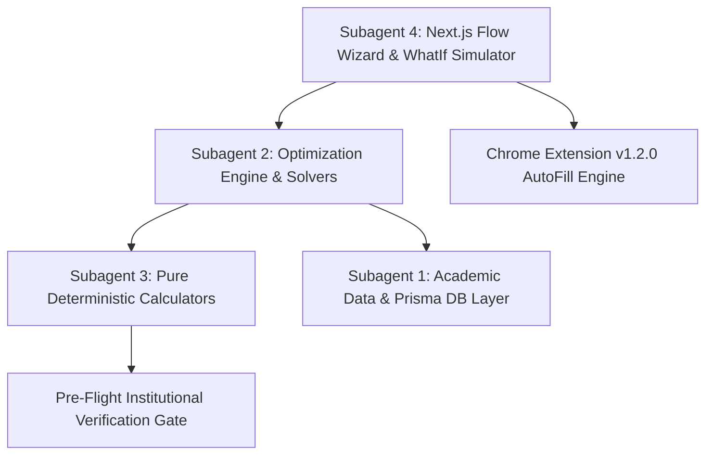

# 🎓 Kalis (קליס / מתקבלים) — Project Master Guide & Architecture Blueprint

> **תעודת זהות ומדריך מקיף למפתחים וסוכני בינה מלאכותית (Single Source of Truth)**
> מסמך זה מרכז את כל הידע, הארכיטקטורה, האלגוריתמיקה, שיקולי החישוב, הקומפוננטות והמצב הנוכחי של פרויקט **Kalis**.
> כל סוכן AI חדש (Antigravity, Claude Code, Cursor, Windsurf, Copilot) שממשיך את העבודה יכול לקרוא מסמך זה ולהמשיך בדיוק מהנקודה שבה הפרויקט נמצא.

---

## 📌 1. סקירת הפרויקט והחזון (Mission & Overview)

**Kalis (קליס)** – מותג הצרכנים: **מתקבלים** ([mitkablim.co.il](https://mitkablim.co.il)) – היא מערכת ישראלית מתקדמת לתכנון, סימולציה ואופטימיזציה של קבלה לתארים אקדמיים באוניברסיטאות בישראל.

### מטרות הליבה:
1. **חישוב סכם מדויק ב-100%**: מודלים דטרמיניסטיים לכל אחת מ-8 האוניברסיטאות, המבוססים על נוסחאות הקבלה הרשמיות (כולל בונוסים מוסדיים, מקצועות חובה, חוקי נשירה, דגשים כמותיים/מילוליים, ובונוסים ריאליים ייחודיים).
2. **מנוע אופטימיזציה ומסלולי שיפור (The Recommendation Engine)**: מציאת שילוב הבחינות האופטימלי (בגרויות ו/או פסיכומטרי) בעל ה-ROI הגבוה ביותר ומינימום עומס קוגניטיבי, המוביל את המועמד לקבלה בטוחה.
3. **סימולטור What-If ובניית מסלול אישי**: מאפשר למועמד לבחון בזמן אמת כיצד שדרוג כל ציון או יחידת לימוד משפיע על סיכויי הקבלה שלו בכל 8 האוניברסיטאות במקביל.
4. **תוסף דפדפן (Chrome Extension v1.2.0)**: ממלא אוטומטית וללא ניחושים (Zero-Guess DataGuard) את נתוני המועמד והציונים המשופרים של המסלול הנבחר ישירות במחשבוני האוניברסיטאות הרשמיים.

---

## 🏛️ 2. שמונה האוניברסיטאות הנתמכות (All 8 Universities)

כל שכבות המערכת (DB, Calculators, Optimizer, UI, Chrome Extension) תומכות באופן מלא ב-8 האוניברסיטאות:

| מוסד | ID במערכת | DB ID | סמל וקטורי רשמי | ייחודיות בחישוב הסכם |
| :--- | :--- | :--- | :--- | :--- |
| **הטכניון** | `technion` | `inst-48` | `public/logos/technion.svg` | סכם $S = 0.5D + 0.075P$. אשכול מדעי (מתמטיקה 5 + פיזיקה/מדמ״ח 5) מזכה בבונוס 30 במקום 20. |
| **אוניברסיטת תל אביב** | `tau` | `inst-6` | `public/logos/tau.svg` | סכם הנדסה/מדמ״ח מוסיף +10 "בונוס ריאלי" רק כשיש מתמטיקה 5 ופיזיקה 5. שימוש בלעדי בפסיכומטרי רב-תחומי. |
| **האוניברסיטה העברית** | `huji` | `inst-1` | `public/logos/huji.svg` | נרמול לפי סטיות תקן וממוצעים ארציים. מסלול קבלה ישירה עם בגרות 105+. |
| **אוניברסיטת בן-גוריון** | `bgu` | `inst-3` | `public/logos/bgu.svg` | סכם כמותי למדמ״ח/טבע ($2.705Q + 0.715V + 0.39E + 6.29B - 448$). סכם הנדסי 200-800 עם בונוס פיזיקה +20. |
| **אוניברסיטת חיפה** | `haifa` | `inst-5` | `public/logos/haifa.svg` | שקלול 50%-50% רב-תחומי, קבלה ישירה עם בגרות 100-102+. |
| **אוניברסיטת אריאל** | `ariel` | `inst-2` | `public/logos/ariel.svg` | סכם 200-800 מדורג, קבלה ישירה למגוון מסלולים. |
| **אוניברסיטת בר-אילן** | `bar_ilan` | `inst-4` | `public/logos/bar_ilan.svg` | בונוס מדעים ייעודי להנדסה/מדמ״ח, קבלה ישירה עם בגרות 102+. |
| **אוניברסיטת רייכמן** | `reichman` | `inst-38` | `public/logos/reichman.svg` | סכם משוקלל ייחודי לבינתחומי, קבלה ישירה עם בגרות 100+. |

---

## 🏗️ 3. ארכיטקטורת המערכת (4 תתי-סוכנים ומודולים)

המערכת בנויה בצורה מודולרית לפי עקרון הפרדת סמכויות מוחלטת (Separation of Concerns):



### 🔹 תת-סוכן 1: שכבת המידע והנתונים (`src/modules/db/`, `prisma/`, `src/data/`)
- **Prisma & SQLite (`prisma/schema.prisma`, `dev.db`)**:
  - `AcademicInstitution`: פרטי 8 האוניברסיטאות.
  - `AcademicProgram`: **721 תוכניות לימוד אקדמיות** עם ספי קבלה רשמיים (`admissionThreshold`), רצפת פסיכומטרי (`psychometricFloor`), דרישת פסיכומטרי מפורשת (`requiresPsychometric: Boolean`), וזכאות לקבלה ישירה (`directBagrutEligible`).
  - `BagrutSubject`: **87 מקצועות בגרות בקטלוג הלאומי** (`src/data/bagrutSubjects.ts`), כולל מתמטיקה, אנגלית, מקצועות חובה, ומקצועות מוגברים מובילים: מדעי המחשב, תכנון ותכנות מערכות, מזרחנות ועולם הערבים, רובוטיקה, הנדסת תוכנה, מדעי הסביבה, משפטים ועוד.
  - `User`, `TargetProgram`, `SavedTrack`: ניהול משתמשים, סנכרון ציונים אישיים ושמירת מסלולי פעולה.
- **Repository (`src/modules/db/repository.ts`)**:
  - שליפה ואינדוקס מהיר של תוכניות, מוסדות ומסלולים שמורים.

### 🔹 תת-סוכן 2: מנוע האופטימיזציה והתכנון (`src/modules/optimizer/`)
- **פרדיגמת 3 המסלולים (Workload Hierarchy)**:
  1. **מסלול 1 (Track A - הממוקד / המהיר)**:
     - מוגבל בקפדנות ל-**0 עד 2 בחינות בלבד**.
     - מתמקד במנוף ה-ROI הגבוה ביותר (למשל: שיפור בגרות בודדת שמביא קבלה ללא שינוי בפסיכומטרי, או פסיכומטרי בלבד).
     - אם בגרות אחת לבדה סוגרת את הפער, מסלול 1 יציע אותה לבדה (Zero Unnecessary Exams).
  2. **מסלול 2 (Track B - המאוזן / פיזור סיכונים)**:
     - מוגבל ל-**2 עד 3 בחינות בלבד** (לעולם לא יותר מ-3).
     - מפזר סיכונים בין פסיכומטרי ל-2 בגרויות, כך שגם אם המועמד משיג ציון פסיכומטרי נמוך יותר, שיפור הבגרויות מפצה על כך ומבטיח קבלה.
     - **כלל חלופה לבחינה בודדת**: אם בגרות בודדת סוגרת את הפער במסלול 1, מסלול 2 יחפש בחינה בודדת חלופית (למשל ספרות במקום תנ״ך) במקום לכפות עומס כפול. אם אין חלופה בודדת, מסלול 2 יושמט.
  3. **מסלול 3 (Track C - הרב-שלבי / לפערים גדולים / הקלה מרבית בפסיכומטרי)**:
     - מיועד למקרים שבהם הפער גדול, או כאשר המועמד רוצה להוריד את דרישת הפסיכומטרי למינימום המתמטי האפשרי ($\text{Floor}(P)$).
     - פורס 4 עד 5 בחינות על פני מועדי חורף וקיץ.
  4. **מכינה (Track Anchor)**:
     - **Opt-In בלבד**: לעולם אינה נכפית כברירת מחדל. זמינה בלחיצה ייעודית בלבד דרך ה-API (`POST /api/tracks/mechina`).
- **שער אימות מוסדי מקדים (Pre-Flight Verification Gate)**:
  - כל מסלול שמוצע מוזן ישירות לתוך המחשבון הטהור של המוסד הרלוונטי (`calculateInstitution`). אם הסכם המחושב נמוך מסף הקבלה, המסלול מכויל או נפסל אוטומטית. אין מסלולים תיאורטיים שלא עומדים בסף האמיתי.
- **מודל תקרת פסיכומטרי ריאלית (`getRealisticPsychometricCeiling` ב-`src/utils/analysis/trackGenerator.ts`)**:
  - מונע הצעת ציוני פסיכומטרי בלתי ריאליים; מתחשב באחוזונים הארציים, בציון הקיים (קפיצות קשות יותר מעל 660 ו-700), בשעות הלמידה ובביטחון האבחוני.
- **לוח זמנים ומקביליות (`calendarScheduler.ts`)**:
  - שילוב חכם של מועדי ישראל: **חורף (ינואר)** למקצועות ליבה ובגרויות קצרות, **אביב (מרץ-אפריל)** לפסיכומטרי, ו**קיץ (יוני-יולי)** להרחבות 5 יח״ל.
  - תוכנית למידה מקבילית (Interleaved): הפסיכומטרי רץ כעמוד שדרה לאורך 3 חודשים, הבגרויות נלמדות במקביל בחודשים 1-2, וחודש 3 מוקדש למרתון סימולציות פסיכומטרי.
- **מניעת מקצועות שנפסלים (Pruning Dropped Subjects)**:
  - המערכת לעולם אינה מציעה לשפר מקצוע שהמחשבון האוניברסיטאי משמיט חוקית (למשל: תוספת של גיאוגרפיה 5 יח״ל בציון 92 שנפסלת כי היא מורידה ממוצע של 114).

### 🔹 תת-סוכן 3: מחשבוני מוסדות טהורים (`src/modules/calculators/`)
- פונקציות מתמטיות טהורות ודטרמיניסטיות ללא תלות במסד נתונים או ב-React:
  - `technion.ts` – הטכניון
  - `tau.ts` – אוניברסיטת תל אביב
  - `huji.ts` – האוניברסיטה העברית
  - `bgu.ts` – אוניברסיטת בן-גוריון
  - `haifa.ts` – אוניברסיטת חיפה
  - `ariel.ts` – אוניברסיטת אריאל
  - `barIlan.ts` – אוניברסיטת בר-אילן
  - `reichman.ts` – אוניברסיטת רייכמן
- **חוקי נשירת מקצועות (Israeli Legal Dropping Rules)**: משמיטים מקצועות בחירה שמורידים את הממוצע, בתנאי שנשמרות לפחות 20 יחידות לימוד עם כל מקצועות החובה (אזרחות, היסטוריה, ספרות, תנ״ך, הבעה, מתמטיקה, אנגלית).

### 🔹 תת-סוכן 4: ממשק המשתמש ותוסף הדפדפן (`src/app/`, `src/components/`, `chrome-extension/`)
- **ממשק הזרימה (`/flow`)**:
  - **שלב 1**: הזנת ציוני בגרות ופסיכומטרי (כולל דגשים כמותי, מילולי ואנגלית).
  - **שלב 2**: בחירת תארים (DegreeSearchSelector) – גריד כרטיסים קומפקטיים בגובה ~70px, פילטרים מרובי בחירה, סל תארים צף משמאל, ומגירת ספי קבלה מתקפלת.
  - **שלב 3**: דוח פערי קבלה אישי (PersonalAdmissionReport) – סיווג מועמדים (התקבלת / נדרש שיפור), גודל הפער בסכם.
  - **שלב 4**: מסלולי פעולה מומלצים ובנייה אישית (`RecommendedTracksView.tsx`):
    - *טאב 1*: ריכוז המסלולים המומלצים (כרטיסים מיושרים, מגירת "הסבר על התוכנית", מטריצת גאנט ללמידה מקבילית, כפתור מכינה Opt-In, כפתור "ערוך מסלול בסימולטור").
    - *טאב 2*: מסלול בנייה אישי – נפתח מדף נקי משיפורים שבו המועמד בונה לעצמו מסלול בעזרת `WhatIfSimulator` וטבלת 8 האוניברסיטאות `MultiUniversityAdmissionGrid`.
- **תוסף כרום (`chrome-extension/` v1.2.0)**:
  - מנגנון **Zero-Guess DataGuard**: ממלא אך ורק שדות שיש להם נתון ודאי בתיק המועמד; שדות ללא נתון נשארים ריקים. שדות חיפוש תואר מוגנים לחלוטין מפני הזנת ציונים.
  - סנכרון חי עם האתר (`chrome.storage.onChanged`): החלפת מסלול באתר Kalis מעדכנת מיידית את מחשבוני האוניברסיטה הפתוחים בכרום.
  - דוק פעולות צף ומעוצב (`kalis-dock.js`) עם חיווי שדות ירוקים ויומן אימות מלא.

---

## 🎨 4. שפת העיצוב והאסתטיקה (Design System)

המערכת פועלת תחת שפת עיצוב יוקרתית ועריכתית (Warm Editorial):
- **רקע הקנבס**: גוון קרם-חול חם ויוקרתי (`#FAF8F5`).
- **גבולות ומחיצות**: רכים ואלגנטיים (`#E5DFD4`).
- **כפתורים ראשיים ואלמנטים פעילים**: אנתרציט מט עמוק (**`#3C3C3C`** עם מעבר עדין ל-`hover:bg-[#2A2A2A]`).
- **טיפוגרפיה וכיווניות**: ממשק RTL טבעי ומוקפד. מעברי ציונים עטופים ב-`dir="ltr"` כדי להבטיח שהחצים יצביעו תמיד מציון קיים לציון יעד ($680 \to 758$).
- **תגיות מועדי בחינות בעלות ניגודיות גבוהה**:
  - חורף (ינואר) ❄️: `bg-[#EEF2FF] text-[#1E40AF] border-[#C7D2FE]`
  - אביב (מרץ-אפריל) 🌱: `bg-[#ECFEFF] text-[#0E7490] border-[#A5F3FC]`
  - קיץ (יוני-יולי) ☀️: `bg-[#FFFBEB] text-[#92400E] border-[#FDE68A]`
- **סמלי וקטור מקוריים**: כל 8 האוניברסיטאות מוצגות עם קובצי SVG רשמיים מתוך `public/logos/`.

---

## 🧮 5. שיקולי חישוב, כללים ואלגוריתמיקה מדויקת

### א. טבלת בונוסים מוסדיים
> **מקור האמת הוא הקוד, לא הטבלה הזו:** פונקציות `get*Bonus` ב-`src/modules/calculators/<university>.ts`, שנעולות מול המקורות הרשמיים ב-`src/modules/calculators/__tests__/officialRules.test.ts`. הטבלה כאן היא תקציר (סונכרן מול הקוד ב-2026-10-03); בכל סתירה — הקוד קובע.

| מקצוע | טכניון | תל אביב | העברית | בן-גוריון | בר-אילן ⚠️ | חיפה | אריאל ⚠️ | רייכמן |
| :--- | :---: | :---: | :---: | :---: | :---: | :---: | :---: | :---: |
| **מתמטיקה 5 יח״ל** | +30 | +35 | +35 | +35 | +35 | +35 | +35 | +35 |
| **מתמטיקה 4 יח״ל** | +10 | +12.5 | +15 | +20 | +15 | +20 | +15 | +12.5 |
| **אנגלית 5 יח״ל** | +25 | +25 | +25 | +25 | +25 | +25 | +25 | +25 |
| **מקצוע בחירה כללי 5 יח״ל** | +20 | +20 | +20 | +20 | +20 | +20 | +20 | +20 |

- **טכניון:** מדעי ליבה/טכנולוגיה מקבלים +30 רק עם "אשכול מדעי" (5 מתמטיקה + 2 מדעים), אחרת +25.
- **בן-גוריון:** בונוס רק לציון **מעל** 60 (`> 60`, לפי הידיעון). בשאר המוסדות `>= 60`.
- ⚠️ בר-אילן ואריאל — טבלאות לא מאומתות מול מקור רשמי.

### ב. כללי ספי קבלה ישירה (Direct Bagrut Admission)
- **העברית / תל אביב**: ממוצע בגרות 105+ מזכה בקבלה ישירה למגוון תוכניות שאינן דורשות פסיכומטרי מפורש.
- **בן-גוריון**: ממוצע בגרות 104+.
- **בר-אילן**: ממוצע בגרות 102+.
- **חיפה, אריאל, רייכמן**: ממוצע בגרות 100+.
- **תוכניות עילית (מדעי המוח, רפואה, הנדסת חשמל/מדמ״ח)**: מוגדרות ב-DB עם `requiresPsychometric: true` ואינן זכאיות לקבלה ישירה ללא פסיכומטרי.

---

## ⚡ 6. פקודות חיוניות ואימות איכות (Quality Gates)

לפני סיום כל משימה, **חובה להריץ ולוודא שהבדיקות עוברות ב-100%**:

```bash
# 1. הרצת בדיקות המחשבונים והבונוסים המוסדיים (49/49 עוברים)
node --test --import jiti/register src/modules/calculators/__tests__/*.test.ts

# 2. הרצת בדיקות ה-DataGuard ותוסף הכרום (14/14 עוברים)
node --test src/modules/qa/__tests__/extensionDataGuard.test.ts

# 3. בדיקת טיפוסים של TypeScript (חייב להחזיר 0 שגיאות)
npx tsc --noEmit

# 4. אימות בניית ייצור (34/34 מסלולים סטטיים ודינמיים)
npm run build
```

---

## 🚀 7. פריסה לענן (Production Deployment)

האתר פעיל ומאובטח בשרת Oracle Cloud VM תחת שרת Caddy עם תעודת SSL אוטומטית:
- **כתובת הייצור**: [https://mitkablim.co.il](https://mitkablim.co.il)
- **כתובת ה-Flow**: [https://mitkablim.co.il/flow](https://mitkablim.co.il/flow)
- **נוהל פריסה (Deployment Protocol)**:
  1. מיזוג השינויים ל-`main` ודחיפה ל-GitHub.
  2. מיזוג ל-`up-to-cloude` ודחיפה ל-GitHub.
  3. הרצת סקריפט הפריסה בשרת הייצור:
     ```bash
     ssh -i /Users/sagikats/Downloads/ssh-key-2026-09-14.key ubuntu@129.159.158.60 "cd ~/kalis && ./scripts/deploy.sh"
     ```
  4. אימות סטטוס תקינות:
     ```bash
     curl -s https://mitkablim.co.il/api/health
     ```

---

## 📍 8. תמונת מצב עדכנית (Current Handoff State)
- **ענף פעיל עדכני**: `main` (מסונכרן עם `origin/main` ו-`up-to-cloude`).
- **סטטוס בדיקות**: **63/63 טסטים עוברים בהצלחה מלאה**.
- **קטלוג בגרויות מעודכן**: כולל מזרחנות, תכנון ותכנות מערכות, הנדסת תוכנה, רובוטיקה, ומדעי הסביבה עם כיול בונוסים מלא ב-8 המוסדות.
- **ממשק Flow**: הוסרו תגיות הבונוס מרשימת הבחירה, שאלון ההעדפות הוסר, ובניית מסלול אישי מתחילה מדף נקי משיפורים.
- **הצעד הבא למפתח הבא**: המערכת יציבה, פרוסה בייצור ומאומתת לחלוטין. ניתן להמשיך ישירות לפיתוח פיצ'רים נוספים לפי בקשות המשתמש!
