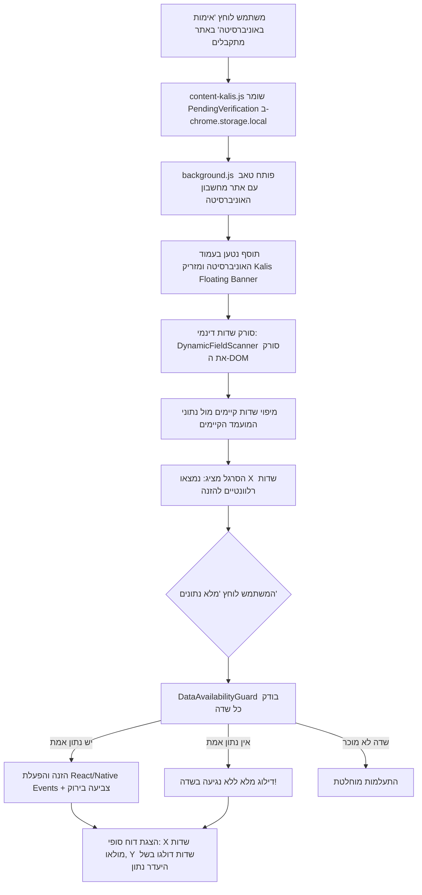

# 🚀 תוכנית עבודה מקיפה (Workflow): מיפוי 8 מחשבוני הסכם ושדרוג תוסף הכרום (Smart AutoFill Engine)

> **סטטוס:** טיוטה לאישור המשתמש (Awaiting Approval)  
> **גרסת תוסף יעד:** `v1.1.0`  
> **מערכת מנחה:** מתקבלים (`kalis`)  

---

## 📋 תקציר מנהלים ועקרונות ליבה

תוכנית עבודה זו מגדירה את השדרוג הארכיטקטוני של **תוסף הכרום של מתקבלים** בהתאם לדרישות המדויקות:

1. **עקרון נתוני האמת בלבד (Strict Data Existence / Zero-Hallucination):**  
   התוסף **לעולם לא ימציא, ינחש או יזין נתון דמה** (כגון 0, 100, 80 או סימון ברירת מחדל). אם למועמד אין ציון פסיכומטרי, אין פיזיקה, אין דגש כמותי או אין מקצוע מסוים — השדה בעמוד האוניברסיטה יישאר ריק וללא מגע.
2. **סריקה וגילוי שדות דינמי (Dynamic Field Discovery):**  
   בכל עמוד מחשבון אליו מגיע המשתמש, התוסף מבצע סריקה דינמית של ה-DOM ומזהה שדות מוכרים המתאימים לנתוני המועמד שנשמרו בעת לחיצה על "אימות באוניברסיטה" באתר מתקבלים.
3. **הפעלה יזומה ושקיפות מלאה (On-Demand Fill & Audit Report):**  
   בעת כניסה לאתר האוניברסיטה מוצג סרגל צף יוקרתי (Kalis Action Dock) המציג למשתמש כמה שדות זוהו. בעת לחיצה על **"מלא נתונים"**:
   - התוסף ממלא אך ורק שדות קיימים שיש עבורם ערך מאומת.
   - התוסף מציג פירוט שקוף: אילו שדות מולאו בהצלחה (בירוק) ואילו שדות דולגו מכיוון שלא הוזנו במערכת.

---

## 🏛️ חלק 1: מיפוי מלא ומפורט של מחשבוני הסכם ב-8 האוניברסיטאות

להלן המיפוי ההנדסי והפונקציונלי של דפי מחשבוני הסכם בכל שמונת המוסדות:

| מוסד | כתובת מחשבון (URL) | ארכיטקטורת עמוד / Framework | סדר הפעולות הנדרש | שדות קלט מרכזיים |
| :--- | :--- | :--- | :--- | :--- |
| **1. האוניברסיטה העברית (HUJI)** | `https://go.huji.ac.il/` | React / Drupal SPA | **דו-שלבי מחייב:** קודם בוחרים חוג מבוקש בתיבת חיפוש/תפריט, ורק לאחר מכן נפתח טופס הזנת הציונים הייעודי לאותו חוג. | • חיפוש חוג מבוקש<br>• ממוצע בגרות מיטבי (או פירוט מקצועות)<br>• פסיכומטרי רב-תחומי<br>• דגש כמותי (אם החוג דורש)<br>• פסיכומטרי עברית (יעל/אמירם) |
| **2. אוניברסיטת תל אביב (TAU)** | `https://go.tau.ac.il/calc` | Drupal + React Hybrid | שלב יחיד / טאבים (טאב חישוב סכם או טאב חישוב בגרות אופטימלית). | • ממוצע בגרות<br>• ציון פסיכומטרי רב-תחומי (ארצי)<br>• מתמטיקה 5 יח"ל (לשקלול בונוס ריאלי)<br>• פיזיקה 5 יח"ל (לשקלול בונוס הנדסי +10) |
| **3. הטכניון (Technion)** | `https://admissions.technion.ac.il/calculator/` | WordPress / Custom jQuery & JS | טופס אחוד מפורט עם טבלאות ציונים ופרקי פסיכומטרי. | • מתמטיקה יח"ל (4 או 5) וציון<br>• אנגלית יח"ל וציון<br>• מקצועות מדע/הגברות (פיזיקה, כימיה, מדמ"ח)<br>• פסיכומטרי כללי<br>• פרק כמותי פסיכומטרי (50–150) |
| **4. אוניברסיטת בן-גוריון (BGU)** | `https://www.bgu.ac.il/` / `https://apps4cloud.bgu.ac.il/calcprod/` | React SPA בתוך iFrame ייעודי | תהליך שלבי בתוך ה-iFrame: שלב 1 - בגרות (ממוצע קיים או מקצועות ליבה), שלב 2 - פסיכומטרי וסכם הנדסי/כמותי. | • ממוצע בגרות קיים<br>• מתמטיקה 4/5 יח"ל וציון<br>• פיזיקה 5 יח"ל וציון<br>• פסיכומטרי רב-תחומי<br>• פרק כמותי / דגש כמותי<br>• בחירת פקולטה/חוג |
| **5. אוניברסיטת בר-אילן (BIU)** | `https://www.biu.ac.il/` / פורטל מועמדים | מערכת טפסים מבוססת ASP.NET / Angular | שלב אחד או שניים: ממוצע בגרות + פסיכומטרי. | • ממוצע בגרות משוקלל<br>• פסיכומטרי כללי<br>• חוג מבוקש (הצגת סיכויי קבלה ירוק/צהוב/אדום) |
| **6. אוניברסיטת חיפה (Haifa)** | `https://admissions.haifa.ac.il/` | טופס Web סטנדרטי | עמוד חישוב סיכויי קבלה מהיר. | • ממוצע בגרות<br>• פסיכומטרי כללי<br>• רמת אנגלית (פטור / מתקדמים)<br>• חוג לימודים |
| **7. אוניברסיטת אריאל (Ariel)** | `https://www.ariel.ac.il/` | טופס חישוב סכם והתאמה | עמוד חישוב ייעודי עם מסלול הנדסה ומסלול כללי. | • ממוצע בגרות<br>• מתמטיקה יח"ל וציון<br>• פסיכומטרי כללי<br>• פרק כמותי |
| **8. אוניברסיטת רייכמן (RUNI)** | `https://www.runi.ac.il/` | טופס React מודרני | ממוצע בגרות ובדיקת זכאות ישירה או פסיכומטרי. | • ממוצע בגרות<br>• פסיכומטרי (רשות בחלק מהתארים)<br>• רמת אנגלית |

---

## 🧠 חלק 2: ארכיטקטורת מנוע ה-AutoFill המשודרג



### 1. מנגנון מניעת הזנת דמה (`DataAvailabilityGuard`)
```javascript
function shouldFillField(fieldKey, candidateData) {
  // 1. בדיקה שהמפתח מוכר
  if (!fieldKey || !(fieldKey in candidateData)) return false;
  
  const val = candidateData[fieldKey];
  // 2. שלילת null, undefined, מחרוזת ריקה, NaN
  if (val === null || val === undefined || val === '') return false;
  if (typeof val === 'number' && (isNaN(val) || val <= 0)) return false;
  
  // 3. עבור ציונים - טווחים הגיוניים בלבד
  if (fieldKey.includes('psychometric') && (val < 200 || val > 800)) return false;
  if (fieldKey.includes('subscore') && (val < 50 || val > 150)) return false;
  if (fieldKey.includes('grade') && (val < 40 || val > 100)) return false;

  return true;
}
```

### 2. מילון סמנטי אוניברסלי לזיהוי שדות (`DynamicFieldRegistry`)
הסורק יבדוק תגיות `input`, `select`, `textarea` וכן שדות React/Custom לפי מאפיינים מרובים:
- **פסיכומטרי כללי:** `[id*="psych"], [name*="psych"], [placeholder*="פסיכומטרי"], [aria-label*="פסיכומטרי"], input[data-field="psychometric"]`
- **דגש / פרק כמותי:** `[id*="quant"], [name*="quant"], [placeholder*="כמותי"], [id*="math_subscore"]`
- **פרק מילולי:** `[id*="verbal"], [name*="verbal"], [placeholder*="מילולי"]`
- **פרק אנגלית:** `[id*="eng"], [name*="english"], [placeholder*="אנגלית"]`
- **ממוצע בגרות:** `[id*="bagrut"], [name*="bagrut"], [placeholder*="ממוצע"], [id*="average"]`
- **מתמטיקה יח"ל / ציון:** זיהוי שורות עם טקסט "מתמטיקה" וחלוקה לסלקטור יחידות (3, 4, 5) וציון (40–100).
- **פיזיקה יח"ל / ציון:** זיהוי שורות פיזיקה.
- **בחירת חוג / תואר:** `input[placeholder*="חפש חוג"], select[name*="faculty"], .program-select`.

### 3. הפעלת אירועי Framework (React 17/18, Angular, Vue, Native)
כדי להבטיח שאתרי SPA מודרניים יזהו את הערך ולא יאפסו אותו:
```javascript
function setElementValue(element, value) {
  element.focus();
  const prototype = element instanceof HTMLSelectElement
    ? window.HTMLSelectElement.prototype
    : window.HTMLInputElement.prototype;
  
  const descriptor = Object.getOwnPropertyDescriptor(prototype, 'value');
  if (descriptor && descriptor.set) {
    descriptor.set.call(element, value);
  } else {
    element.value = value;
  }

  // הפצת שרשרת אירועים מלאה
  element.dispatchEvent(new Event('input', { bubbles: true, composed: true }));
  element.dispatchEvent(new Event('change', { bubbles: true, composed: true }));
  element.dispatchEvent(new Event('blur', { bubbles: true, composed: true }));
  
  // חיווי ויזואלי למשתמש שהשדה אומת ומולא
  element.style.backgroundColor = '#EBF4EE';
  element.style.borderColor = '#22C55E';
}
```

---

## 🛠️ חלק 3: תוכנית העבודה המפורטת (Work Breakdown Structure)

### שלב א׳: תשתית הליבה ומנגנון הבטיחות
- [ ] יצירת מודול `src/scanner/fieldScanner.js` בתוך תיקיית התוסף:
  - סריקת DOM רקורסיבית כולל Iframes.
  - זיהוי שדות לפי מילון סמנטי רב-שכבתי.
- [ ] יצירת מודול `src/guard/dataGuard.js`:
  - אכיפת חוק "יש נתון ➔ מזין; אין נתון ➔ לא נוגע".
- [ ] עדכון `background.js` ו-`manifest.json`:
  - וידוא הרשאות `storage`, `tabs`, `activeTab` וכל הדומיינים של 8 האוניברסיטאות.

### שלב ב׳: התאמת סקריפטי האוניברסיטאות (Content Scripts)
- [ ] **האוניברסיטה העברית (`content-huji.js`):**
  - טיפול ברצף הדו-שלבי ב-`go.huji.ac.il`: איתור תיבת חיפוש התואר, הזנת שם התואר המבוקש ולחיצה לבחירתו.
  - לאחר פתיחת שדות הציונים: הזנת ממוצע בגרות וציון פסיכומטרי בלבד (ללא נתוני דמה).
- [ ] **אוניברסיטת תל אביב (`content-tau.js`):**
  - תמיכה מלאה ברינדור המאוחר של רכיב React של מחשבון TAU.
  - הזנת פסיכומטרי רב-תחומי, ממוצע בגרות, ופיזיקה/מתמטיקה אם קיימים בלבד.
- [ ] **הטכניון (`content-technion.js`):**
  - מיפוי הטופס המפורט ב-`admissions.technion.ac.il/calculator`: יח"ל מתמטיקה, ציון מתמטיקה, פסיכומטרי ופרק כמותי.
- [ ] **אוניברסיטת בן-גוריון (`content-bgu.js`):**
  - חדירה בטוחה ל-iFrame של `apps4cloud.bgu.ac.il`.
  - תמיכה במחשבון הדו-שלבי: בגרות ➔ המשך ➔ פסיכומטרי.
- [ ] **אוניברסיטאות בר-אילן, חיפה, אריאל, ורייכמן (`content-general.js`):**
  - הפעלת הסורק הדינמי החדש במחשבוני 4 האוניברסיטאות.

### שלב ג׳: ממשק משתמש צף מעודכן בעמוד האוניברסיטה (Kalis Floating Dock)
- [ ] יצירת סרגל עליון/תחתון קומפקטי ואלגנטי בעמוד האוניברסיטה (`#FAF8F5`, מסגרת `#3C3C3C`):
  - הצגת סטטוס: "סייען מתקבלים: זוהו X שדות למילוי עבור תואר Y".
  - כפתור פעולה ראשי: **"מלא נתונים אוטומטית"** (`#3C3C3C`).
  - כפתור סגירה/הסתרה.
  - דו"ח ביצוע חי: פירוט כמה שדות מולאו וכמה שדות דולגו.

### שלב ד׳: בדיקות, אימות והפצה
- [ ] בדיקות ידניות ואוטומטיות בכל 8 האתרים עם 4 פרופילי מועמדים שונים (מלא, חלקי, ללא פסיכומטרי, ללא פיזיקה).
- [ ] אריזת התוסף והכנת קובץ zip לבדיקה מקומית (Developer Mode) ולהעלאה ל-Chrome Web Store.

---

## 🧪 חלק 4: מטריצת בדיקות ותרחישי קיצון (Edge Cases)

| תרחיש בדיקה | פרופיל מועמד במתקבלים | תוצאה מצופה בעמוד האוניברסיטה |
| :--- | :--- | :--- |
| **1. מועמד ללא פסיכומטרי** | בגרות 108.5, פסיכומטרי: לא נבחן | שדה הבגרות ממולא (108.5). **שדה הפסיכומטרי נשאר ריק לחלוטין!** (לא מוזן 0 ולא מוזן ערך דמה). |
| **2. מועמד ללא פיזיקה** | בגרות מלאה (מתמטיקה 5, אנגלית 5, מדמ"ח 5), ללא פיזיקה | מתמטיקה ואנגלית ממולאים. שורת פיזיקה נשארת ריקה ללא בחירת מקצוע. |
| **3. חוג הדורש דגש כמותי (HUJI/BGU)** | פסיכומטרי כללי 710, דגש כמותי 725 | שניהם מוזנים לשדות הייעודיים שלהם בדיוק של 100%. |
| **4. אתר עם טעינה איטית (SPA)** | חיבור איטי, רכיב המחשבון נטען אחרי 3 שניות | התוסף ממתין בסבלנות (MutationObserver / Polling) ומציג את כפתור המילוי רק כשהשדות זמינים ב-DOM. |

---

## 📌 החלטות נדרשות לאישור

1. **האם לאשר את תוכנית העבודה הזו כפי שהיא ולהתחיל במימוש שלב א׳ (ארכיטקטורת הסורק ומנגנון הבטיחות)?**
2. **האם ישנן דרישות או התאמות ספציפיות נוספות שתרצה לכלול במבנה הסרגל הצף או באופן המילוי?**
