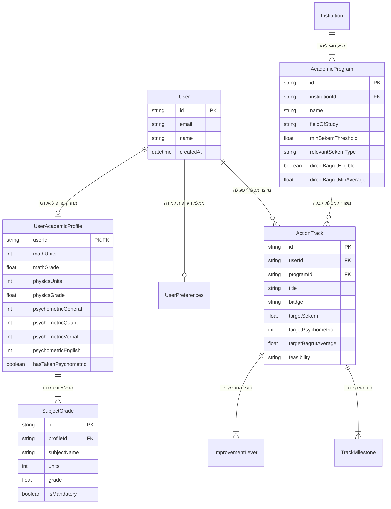

<div dir="rtl" style="text-align: right; direction: rtl;">

# 🗄️ מודול ארכיטקטורה ומודלי נתונים (Subagent 1)

מודול זה מגדיר את סכמת הנתונים המרכזית, המודלים והטבלאות של מערכת Kalis, כולל שכבת גישה (Data Access Layer / Repository) אינדקסית, ולידציית Zod מחמירה, והכנה מלאה למיגרציה עתידית מול PostgreSQL / Prisma.

---

## 📐 1. דיאגרמת ישויות וקשרים (ERD)



---

## 🗃️ 2. מודלי הנתונים המרכזיים (`schema.ts`)

1. **`User` & `UserAcademicProfile`:**
   מייצג את זהות המועמד והישגיו הלימודיים:
   * פירוט מלא של מקצועות הבגרות, יחידות וציונים.
   * התמחות מדעית: יחידות וציוני מתמטיקה ופיזיקה (משתני מפתח בחישוב סכמי הנדסה).
   * פסיכומטרי ופילוח סעיפיו (כמותי, מילולי, אנגלית) ודגל `hasTakenPsychometric`.
2. **`AcademicProgram` (חוג לימודים):**
   מייצג מסלול קבלה אקדמי באוניברסיטה:
   * `minSekemThreshold`: סף קבלה רשמי עדכני.
   * `relevantSekemType`: סוג הסכם הרלוונטי (`general`, `engineering`, `management`, `technion`).
   * `directBagrutEligible` & `directBagrutMinAverage`: הגדרת זכאות וסף לקבלה ישירה על סמך בגרות ללא פסיכומטרי.
3. **`ActionTrack`, `ImprovementLever`, `TrackMilestone`:**
   מודלי נתונים של תוכניות הפעולה המותאמות:
   * חלוקה למסלולים (המהיר, המאוזן/הבטוח, העוגן האקדמי).
   * מנופי שיפור קונקרטיים (מקצוע יעד, יחידות יעד, ציון יעד, עדיפות ונימוק).
   * אבני דרך מתוזמנות לפי שבועות.

---

## ⚡ 3. ארכיטקטורת שכבת הגישה והאינדוקס (`repository.ts`)

כדי להבטיח זמני תגובה אפסיים ($< 5\text{ms}$) ולמנוע בעיות של N+1:
* **טעינה ואינדוקס חד-פעמי:** כלל החוגים מ-`academicData.json` נטענים ומוזנים לאינדקסים מבוססי `Map`:
  * `programsById`: שליפה לפי מזהה ב-$O(1)$.
  * `programsByInstitution`: שליפת כל תוכניות האוניברסיטה ב-$O(1)$.
  * `programsByField`: אינדקס מבוסס תגיות חיפוש עבור סינון חוגים מהיר.
* **ניהול מצב משתמש (State Persistence):**
  * שמירה, אחזור ועדכון מהירים של פרופילי מועמדים ומסלולים מומלצים.

---

## 🛡️ 4. אימות קלט בזמן ריצה (`validation.ts`)

מודול ה-Validation מיישם סכמות **Zod** קפדניות:
* אימות ציוני בגרות (0–100), יחידות (1–5).
* אימות ציוני פסיכומטרי (200–800, כמותי/מילולי 50–150).
* אימות שלמות של פרופיל אקדמי ומסלולי שיפור.

---

## 🐘 5. מוכנות לפרודקשן (Prisma Schema)

בקובץ `schema.ts` מוגדרת מחרוזת ה-Prisma המלאה (`PRISMA_SCHEMA_DEFINITION`), המאפשרת מיגרציה מיידית ל-PostgreSQL באמצעות:
```bash
npx prisma db push
```

</div>
